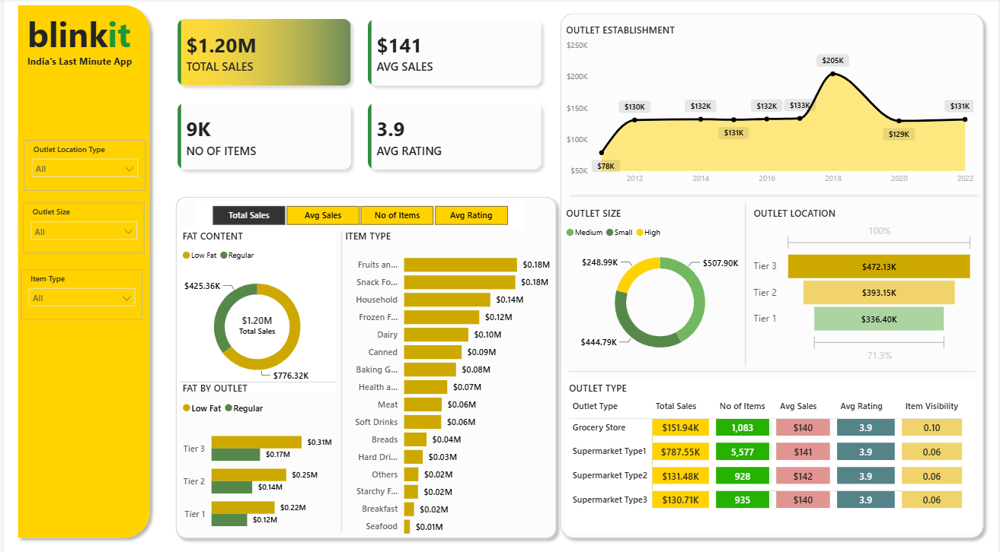

# BlinkIT Sales Dashboard (Power BI)

## Project Overview
An interactive Power BI dashboard built to analyze BlinkIT grocery sales performance across outlet types, locations, item categories, and customer ratings.

## Key Metrics
- Total Sales
- Average Sales
- Number of Items Sold
- Average Rating

## Dashboard Features
- Sales by Item Type
- Sales by Outlet Location
- Sales by Outlet Size
- Sales by Outlet Type
- Fat Content Analysis
- Interactive Filters and Slicers

## Tools Used
- Power BI
- Power Query
- DAX
- Data Visualization

## Business Insights
- Identified top-performing outlet categories.
- Analyzed sales trends across outlet locations.
- Evaluated customer preferences based on item categories.
- Compared performance of different outlet sizes.

## Skills Demonstrated
- Data Cleaning
- Data Modeling
- DAX Calculations
- Dashboard Design
- Business Intelligence

  ## Dashboard Preview

